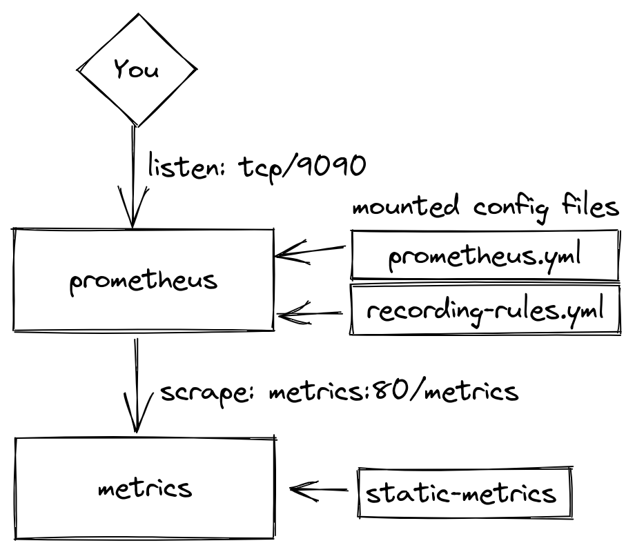

# Prometheus relabel config playground

This Repo helps creating and debugging prometheus relabel configs and recording
rules by running a local prometheus instance that scrapes metrics from a static
file.

## Prerequisites

* [podman](https://podman.io/) or docker
* [podman-compose](https://github.com/containers/podman-compose) or the docker equivalent

## Using this project

> This short guide will be using `podman-compose`. If you're on `docker`, you should be able to just substitute `podman-compose` with `docker-compose`. But i did not test it with docker-compose.

Start the stack using podman-compose:

```
podman-compose up --force-recreate
```

This will spin up prometheus and the static metrics server. The stack looks like this:



The prometheus UI will be made available under [localhost:9090](http://localhost:9090).

Changes to [static-metrics](./static-metrics) should show up pretty immediately in the prometheus ui, as the scrape and evaluation_interval interval is only 1 second. (yes, that's not a lot. I don't like waiting)

For changes to the [relabel-configs](./prometheus.yml#L22) and [recording-rules.yml](./recording-rules.yml) to be effective, you will need to re-start the stack.

## Node Exporter

By uncommenting the last 4 lines from [prometheus.yml](./prometheus.yml#L27) and the code block starting at line 14 in [docker-compose.yml](./docker-compose.yml#L14), node-exporter will also spawn and be scraped by the prometheus instance. This give you a whole lot more non-synthetic metrics to play around with.
